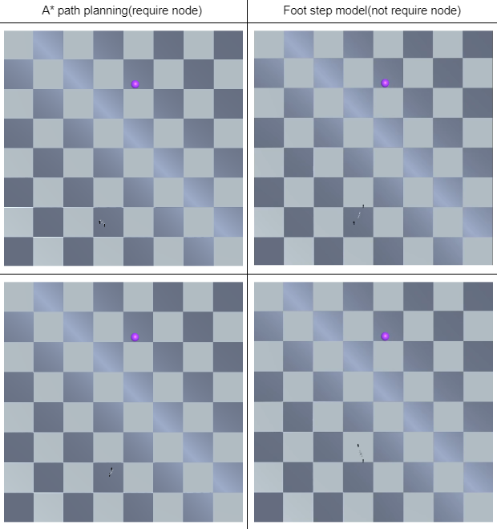
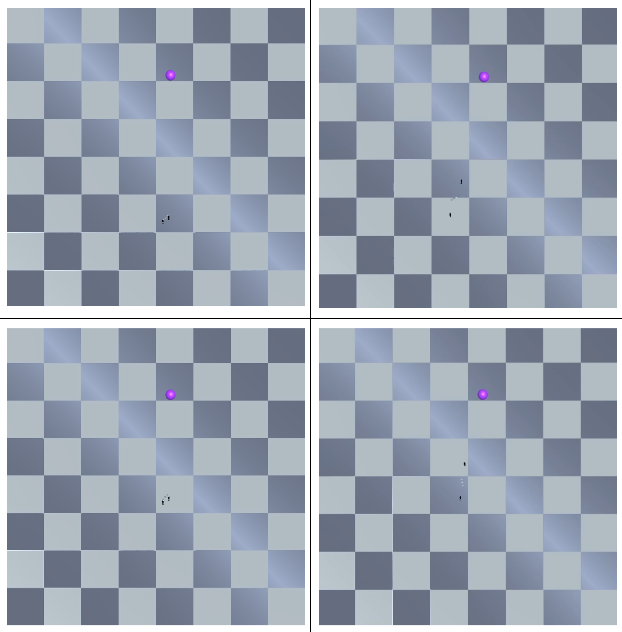
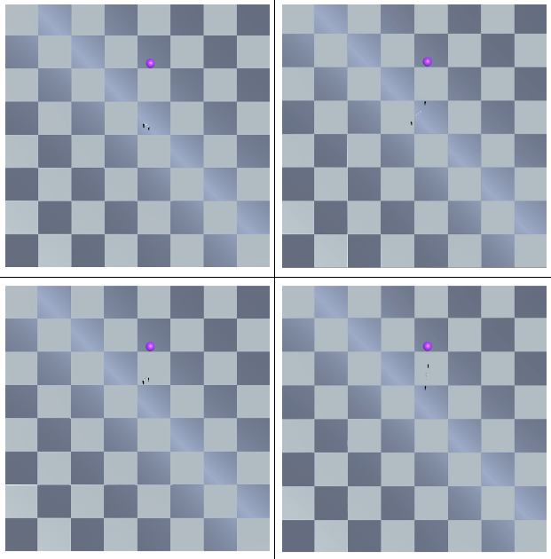
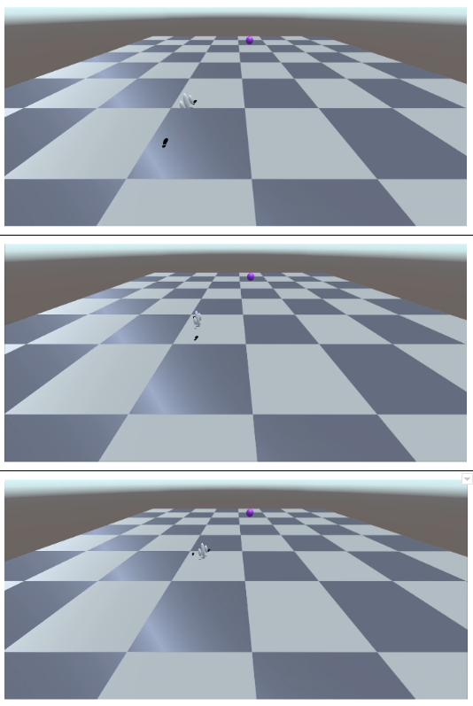
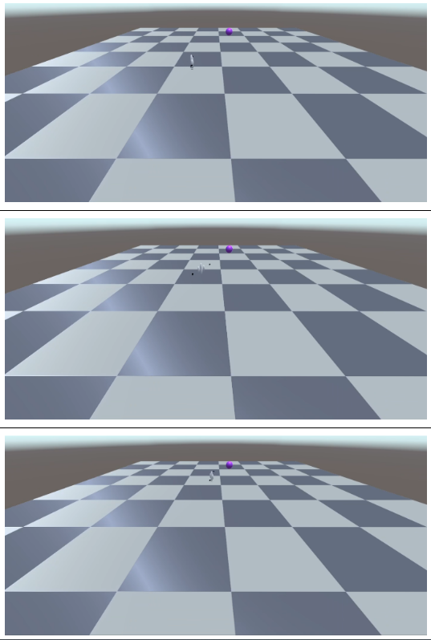

# FootStepModel_with_RL

  

footstep model with rl can be used to creating realistic footsteps.

Pengxiang Jia, Yide Ma

This is a novel implementation of paper: [Footstep navigation for dynamic crowds](https://people.cs.rutgers.edu/~mk1353/pdfs/footstep-navigation.pdf).
We have utilize different rl algorithm to train the footstep model.

# Environments: 
!conda create -n xxx python=3.9
!conda activate xxx
!pip install mlagent==0.30.0
#also install cuda and pytorch in your environments
#i used cuda 11.6 and pytorch 1.12.1
#unity version we use: 2019.4.29f1
#ml-agent version in unity editor i used is 2.0

# Running
make sure the pretrain model is in the nn module for body, then play

# Training
if you want to play around with training, use the command below:
!mlagents-learn C:\Users\xxx\OneDrive\Desktop\FootStepModel_with_RL\Config\MyBehavior.yaml --run-id=MyBehavior --force

if you want to resume training from a mlagent check point in the result folder
!mlagents-learn C:\Users\xxx\OneDrive\Desktop\FootStepModel_with_RL\Config\MyBehavior.yaml --run-id=MyBehavior --resume

# Result of using ppo network

before rl-algorithms training:

after ppo training:

the training curve:

----------------------

# Comparison with A* algo:

  

  

  

  

  

To be continued...

# Viewing the results
!tensorboard --logdir results --port 6006
#then open http://localhost:6006/

